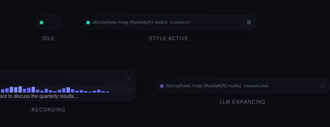
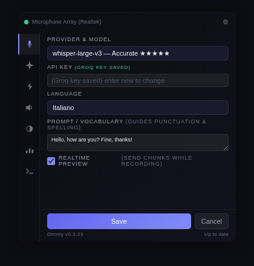
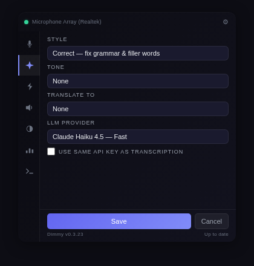
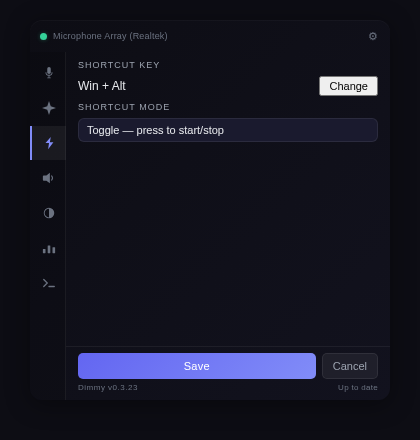
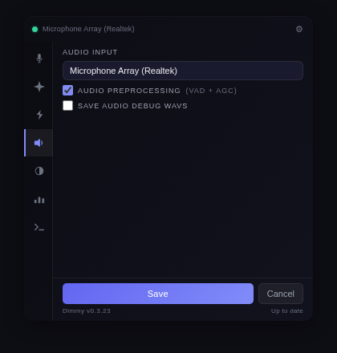
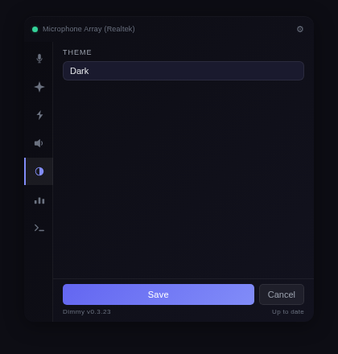
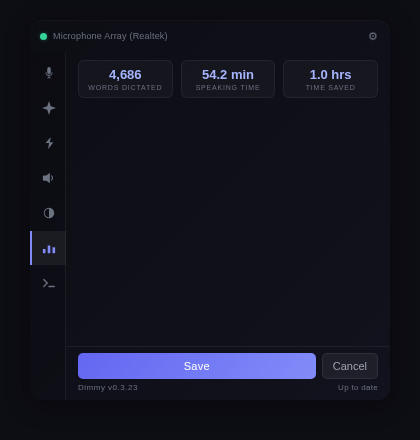

<p align="center">
  
</p>

<h1 align="center">Dimmy</h1>

<p align="center">
  Cross-platform voice transcription overlay. Hold a shortcut, speak, release — your words appear wherever you're typing.
</p>

<p align="center">
  <a href="https://github.com/KonradDallaOrg/dimmy/actions/workflows/ci.yml"></a>
  <a href="https://github.com/KonradDallaOrg/dimmy/releases/latest"></a>
  <a href="https://github.com/KonradDallaOrg/dimmy/blob/main/LICENSE"></a>
  
</p>

---

## How It Works

Dimmy runs as a small overlay on your screen. Press a keyboard shortcut to start recording, speak naturally, then press again (or release, in hold mode) to stop. Your audio is sent to a speech-to-text provider, optionally enhanced by an LLM, and the result is pasted into whatever application has focus.

## Features

- **Universal dictation** — works with any application via clipboard paste
- **Always-on-top overlay** — minimal pill UI with waveform visualization
- **Streaming transcription** — real-time chunks via OpenAI-compatible APIs
- **Realtime preview** — optionally send chunks while recording, or wait for final result
- **AI enhancement** — post-process with LLM (correct, summarize, elaborate, 13 styles total)
- **Multiple providers** — Groq, OpenAI, Deepgram, Gemini, Anthropic, or any custom endpoint
- **Anti-hallucination guard** — skips audio chunks with less than 0.5s of speech
- **Per-provider API keys** — encrypted locally by default, optional OS keyring, switch without re-entering
- **Audio preprocessing** — noise filtering + normalization for cleaner input
- **Configurable shortcut** — toggle or hold mode, any 2-modifier combo
- **Multilingual** — auto-detect or select from 12+ languages
- **Privacy-first** — no telemetry, all data local, keys encrypted on device
- **Auto-update** — built-in update checker with one-click install

## Platforms

| Platform | UI Framework | Status |
|----------|-------------|--------|
| Windows | WinUI 3 (C#) | Native |
| macOS | SwiftUI | Native |
| Linux | GTK4 + libadwaita (Rust) | Native |

Each platform has its own native UI that looks and feels right for the OS, while sharing the same Rust core for audio capture, transcription, and post-processing.

## Architecture

```
+-------------------+   +-------------------+   +-------------------+
|  Windows (WinUI3) |   |  macOS (SwiftUI)  |   | Linux (GTK4/Rust) |
|       C# UI       |   |     Swift UI      |   |   Rust + GTK4     |
+--------+----------+   +--------+----------+   +--------+----------+
         |  C FFI               |  C FFI               |  Rust lib
         v                      v                      v
+---------------------------------------------------------------+
|                     Shared Rust Core                           |
|  audio.rs  preprocess.rs  transcribe.rs  llm.rs  provider.rs  |
|  ffi.rs (20+ exported C functions)   keystore   hotkey        |
+---------------------------------------------------------------+
         |                      |                      |
         v                      v                      v
   STT Providers          LLM Providers          OS Audio (cpal)
```

The shared core (`src-tauri/src/`) handles all business logic. Windows and macOS call it through C FFI (`ffi.rs`). Linux links directly as a Rust library.

## Screenshots

<p align="center">
  
</p>

<details>
<summary><strong>Settings panel</strong></summary>

<p align="center">
  
  
  
</p>
<p align="center">
  
  
  
</p>

</details>

## Download

Get the latest release for your platform:

**[Download Dimmy](https://github.com/KonradDallaOrg/dimmy/releases/latest)** — Windows (.exe), macOS (.dmg), Linux (.AppImage, .deb)

## Quick Start

1. Launch Dimmy — a small green dot appears in the corner of your screen
2. Open Settings (click the gear icon or right-click the pill)
3. Enter an API key for transcription (see [STT Providers](#stt-providers) below)
4. Press **Win+Alt** (default) to start recording
5. Speak naturally
6. Press **Win+Alt** again to stop — text is transcribed and pasted into the active app

## STT Providers

Dimmy needs an API key for speech-to-text transcription. Choose a provider:

| Provider | Type | Models | Free Tier | Get Key |
|----------|------|--------|-----------|---------|
| **Groq** (recommended) | STT + LLM | whisper-large-v3, whisper-large-v3-turbo, llama-3.3-70b | Yes (rate limited) | [console.groq.com/keys](https://console.groq.com/keys) |
| **OpenAI** | STT + LLM | gpt-4o-transcribe, gpt-4o-mini-transcribe, whisper-1, gpt-4o-mini | ~$0.006/min | [platform.openai.com/api-keys](https://platform.openai.com/api-keys) |
| **Deepgram** | STT | Nova-3, Nova-2 | $200 free credits | [console.deepgram.com](https://console.deepgram.com/) |
| **Google Gemini** | STT + LLM | gemini-2.5-flash, gemini-2.5-pro | Yes | [aistudio.google.com/apikey](https://aistudio.google.com/apikey) |
| **Anthropic** | LLM only | Claude Haiku 4.5, Claude Sonnet 4 | No | [console.anthropic.com/keys](https://console.anthropic.com/settings/keys) |
| **OpenRouter** | LLM only | Llama 3.3 70B, DeepSeek R1 | Yes (free models) | [openrouter.ai/keys](https://openrouter.ai/keys) |

Paste your key in Settings. Keys are encrypted locally on your device (AES-256). For extra security, enable **OS secure storage** (Keychain / Credential Manager) in Settings. You can also use any **custom endpoint** compatible with the OpenAI API format.

<details>
<summary><strong>STT Provider Benchmarks</strong></summary>

Benchmarked on real audio files (LibriVox, public domain). Match% = word overlap vs reference transcript. All files are 16kHz mono WAV.

#### Short audio (5s - 90s)

| Sample | Duration | Groq turbo | Groq v3 | OpenAI whisper-1 | OpenAI 4o-transcribe | OpenAI 4o-mini | Deepgram Nova-3 | Gemini Flash |
|--------|----------|-----------|---------|-----------------|---------------------|---------------|----------------|-------------|
| JFK "Ask not" | 11s | **815ms** 100% | 832ms 100% | 1834ms 100% | 1173ms 100% | 1188ms 100% | 2227ms 100% | 1569ms 100% |
| Micro Machines (fast) | 29s | **838ms** 100% | 1088ms 100% | 3545ms 73% | 5161ms 100% | 2211ms 100% | 3304ms 93% | 2689ms 93% |
| Gettysburg Address | 10s | **823ms** 100% | 716ms 100% | 1875ms 100% | 1563ms 100% | 1245ms 100% | 4008ms 100% | 1669ms 89% |
| Harvard (female, 8kHz) | 33s | **902ms** 100% | 943ms 100% | 1849ms 100% | 2349ms 100% | 1781ms 100% | 4390ms 100% | 2087ms 100% |

#### Medium audio (5 - 11 min)

| Sample | Duration | Groq turbo | Groq v3 | OpenAI whisper-1 | OpenAI 4o-mini | Deepgram Nova-3 | Gemini Flash |
|--------|----------|-----------|---------|-----------------|---------------|----------------|-------------|
| Pinocchio Ch.1 (EN) | 4:53 | **1.5s** 100% | 1.5s 100% | 15.1s 100% | 10.4s 100% | 19.1s 100% | 11.0s 100% |
| Tale of Two Cities | 6:49 | **1.7s** 100% | 2.1s 100% | 22.4s 100% | 14.6s 100% | 26.4s 100% | 10.0s 100% |
| Pride & Prejudice | 10:38 | **4.6s** 100% | 3.3s 100% | 34.1s 100% | 25.3s 100% | 66.0s 77% | 15.3s 100% |
| Pinocchio Cap.1 (IT) | 5:35 | **1.7s** 100% | 2.1s 100% | 16.5s 100% | 14.1s 100% | 40.5s 100% | 8.3s 100% |
| Divina Commedia (IT) | 42:00 | >25MB | >25MB | >25MB | >25MB | 249.2s | >20MB |

#### Key takeaways

- **Groq is 10-20x faster** than all other providers with equal or better accuracy
- **Deepgram** handles large files natively (2GB limit) but is slower on shorter audio
- **Gemini Flash** offers a good balance of speed and quality, especially for medium-length audio
- **OpenAI whisper-1** has good accuracy but is consistently the slowest
- Files over 25MB require chunking for Groq/OpenAI (Dimmy handles this automatically)

*Benchmark date: 2026-03-13. Run `./tests/test_benchmark.sh quick` to reproduce.*

</details>

## LLM Post-Processing

Enable in Settings to send transcriptions through an LLM for cleanup or transformation. Requires a separate LLM API key (or check "Use same key" if your provider also offers chat completions).

| Style | Effect |
|-------|--------|
| Off | No LLM processing |
| Correct | Fix grammar and filler words |
| Summarize | Condense key points |
| Elaborate | Expand with detail |
| Comprehensible | Rewrite clearly |
| Professional | Business tone |
| Prompt | Reshape as LLM prompt |
| Gen-Z | Gen-Z slang rewrite |
| Boomer | Old-school formal rewrite |
| Emoji | Heavy emoji insertion |
| Acronyms | Replace phrases with abbreviations |
| Imbruttito | Milanese grumpy rewrite |
| Custom | Your own system prompt |

Scroll wheel on the pill to cycle styles. Ctrl+scroll to cycle tone.

## Build from Source

### Prerequisites

- [Rust](https://rustup.rs/) (latest stable)

### Windows

Requires [Visual Studio 2022+](https://visualstudio.microsoft.com/) with the following workloads:
- .NET Desktop Development
- Windows App SDK (WinUI 3)
- Desktop Development with C++

```bash
# Build the shared library
cd src-tauri
cargo build --release --lib

# Open the Windows UI project in Visual Studio
# Located at: src-windows/Dimmy.sln
```

### macOS

Requires Xcode + Command Line Tools.

```bash
xcode-select --install

# Build the shared library
cd src-tauri
cargo build --release --lib --target universal-apple-darwin

# Open the SwiftUI project in Xcode
# Located at: src-macos/Dimmy.xcodeproj
```

### Linux

Requires GTK4 and libadwaita development libraries.

```bash
# Ubuntu/Debian
sudo apt install libgtk-4-dev libadwaita-1-dev libasound2-dev libxdo-dev

# Build the full application
cd src-tauri
cargo build --release
```

## Development

```bash
cd src-tauri

# Run tests
cargo test

# Format
cargo fmt

# Lint (CI enforces zero warnings)
cargo clippy -- -D warnings
```

### Pre-Push Checklist

- `cargo fmt --check` — clean
- `cargo clippy -- -D warnings` — zero warnings
- `cargo test --lib` — all pass
- Version matches in `Cargo.toml` and `tauri.conf.json`

## Tech Stack

| Layer | Technology |
|-------|-----------|
| Core | Rust |
| Windows UI | WinUI 3 / C# |
| macOS UI | SwiftUI |
| Linux UI | GTK4 + libadwaita / Rust |
| Audio capture | cpal |
| Noise filter | nnnoiseless + biquad |
| Secure storage | AES-256 local (default) + OS keyring (opt-in) |
| HTTP | reqwest |

## Support

If Dimmy saves you time, consider supporting its development:

- [Buy Me a Coffee](https://buymeacoffee.com/konraddall5)
- [Ko-fi](https://ko-fi.com/konraddalla)

## License

[AGPL-3.0](LICENSE) — free to use, modify, and distribute. If you redistribute or offer it as a service, your code must remain open source under the same license.
