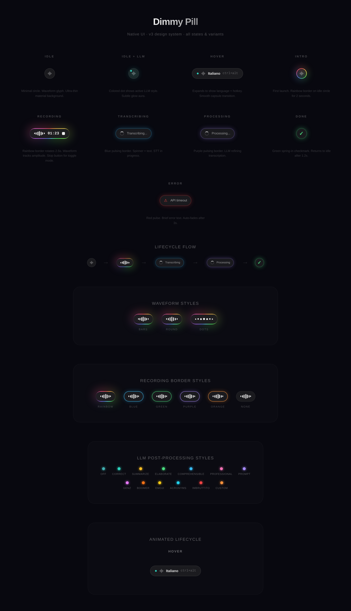
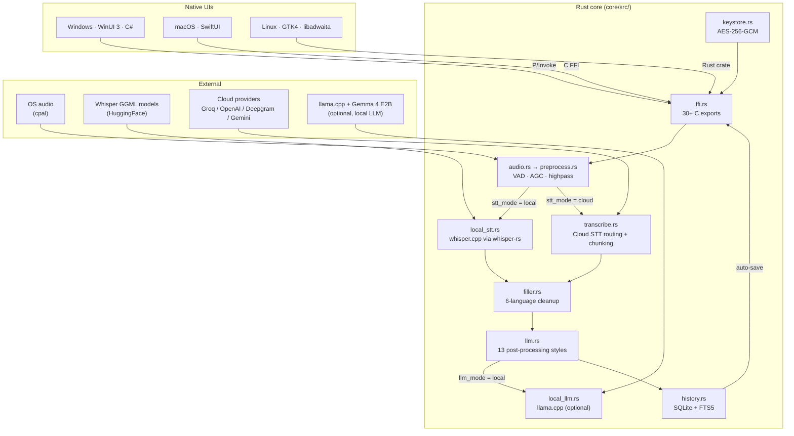

<p align="center">
  
</p>

<h1 align="center">Dimmy</h1>

<p align="center">
  <em>Speak instead of typing. Native voice dictation for Windows, macOS, and Linux.</em>
</p>

<p align="center">
  <a href="https://github.com/KonradDallaOrg/dimmy/actions/workflows/ci.yml"></a>
  <a href="https://github.com/KonradDallaOrg/dimmy/releases/latest"></a>
  <a href="https://github.com/KonradDallaOrg/dimmy/releases"></a>
  <a href="https://github.com/KonradDallaOrg/dimmy/blob/main/LICENSE"></a>
  
  
</p>

<p align="center">
  <a href="https://dimmy.app"><strong>Website</strong></a> ·
  <a href="https://github.com/KonradDallaOrg/dimmy/releases/latest"><strong>Download</strong></a> ·
  <a href="docs/ARCHITECTURE.md"><strong>Architecture</strong></a> ·
  <a href="docs/BUILD.md"><strong>Build</strong></a> ·
  <a href="CONTRIBUTING.md"><strong>Contribute</strong></a>
</p>

<p align="center">
  
</p>

---

## Contents

- [What is Dimmy?](#what-is-dimmy)
- [Highlights](#highlights)
- [Install](#install)
- [Quick start](#quick-start)
- [The pill](#the-pill)
- [How it works](#how-it-works)
- [STT providers](#stt-providers)
- [Benchmarks](#benchmarks)
- [LLM post-processing](#llm-post-processing)
- [Build from source](#build-from-source)
- [Testing & quality](#testing--quality)
- [CI / CD](#ci--cd)
- [Contributing](#contributing)
- [Roadmap](#roadmap)
- [FAQ](#faq)
- [Acknowledgements](#acknowledgements)
- [License](#license)
- [Support](#support)

---

## What is Dimmy?

The name is pronounced like **"Dimi"** — short for *dimmi*, Italian for *"tell me"*.

Dimmy is a cross-platform desktop app that turns your voice into text — instantly, in any application. It runs as a tiny overlay on your screen. Press a hotkey, speak, and your words are transcribed and pasted into whatever has focus: editors, browsers, chat apps, terminals, anywhere a cursor blinks.

Built with **native UIs** for every platform — no Electron, no WebView, no browser shell. A shared Rust core handles all the heavy lifting (audio capture, transcription, AI post-processing, history, key storage), while each platform gets its own native frontend: **WinUI 3** on Windows, **SwiftUI** on macOS, **GTK4 + libadwaita** on Linux.

Learn more at **[dimmy.app](https://dimmy.app)**.

## Highlights

- **Local offline transcription** powered by [whisper.cpp](https://github.com/ggerganov/whisper.cpp) and [Parakeet TDT v3](https://huggingface.co/nvidia/parakeet-tdt-0.6b-v3). No API key, no internet, no data leaving your machine.
- **Universal dictation** into any application via clipboard paste — editors, browsers, chat, terminals.
- **Meeting mode** — long-form record with streaming WAV + chunked live transcript + LLM-generated structured recap (TLDR + decisions + actions + next steps + risks + …). Pause / resume mid-meeting; the paused window is excluded from the WAV and the timeline.
- **File load** — drop or pick a WAV / MP3 / MP4 to transcribe offline (whisper or Parakeet) or via cloud, with waveform preview and silence-aware chunking for files above provider limits.
- **Native per platform** — WinUI 3, SwiftUI, GTK4. Feels right at home, runs fast, uses little memory.
- **Always-on-top pill overlay** with live waveform visualization and per-state colour feedback.
- **Cloud STT providers** — Groq (fastest), OpenAI, Deepgram, Google Gemini, or any OpenAI-compatible endpoint.
- **LLM post-processing** — 13 styles (correct grammar, summarize, rewrite professionally, translate, custom prompts, and more) with per-app rules that auto-switch style based on which app had focus when you pressed the hotkey.
- **Filler word removal** — strips "um", "basically", "cioè" etc. in six languages.
- **Searchable history** — SQLite + FTS5 full-text search over every transcription, with audio playback + word timestamps for past dictations.
- **Privacy-first** — no account; API keys encrypted locally with AES-256-GCM; minimal anonymous opt-out telemetry (no transcripts, no prompts, no IP — full list in [`PRIVACY.md`](PRIVACY.md)).
- **GPU acceleration** — Metal on Apple Silicon, Vulkan on Windows (all GPU vendors), CUDA on NVIDIA. Parakeet runs on the Apple Neural Engine on M-series Macs at 100–300× realtime.
- **Multilingual** — auto-detect or pick from 12+ languages.
- **Configurable hotkey** — toggle or hold-to-record, any modifier combination.
- **Auto-update** — checks GitHub for new releases, notifies from Settings → About.

## Install

| Platform | File | Requirements |
|----------|------|--------------|
| **Windows** | [`Dimmy-Setup.exe`](https://github.com/KonradDallaOrg/dimmy/releases/latest) | Windows 10 or newer. VC++ Redistributable is installed automatically by the installer. |
| **macOS** | [`Dimmy-macos-arm64.dmg`](https://github.com/KonradDallaOrg/dimmy/releases/latest) | macOS 12 Monterey or newer, Apple Silicon (M1/M2/M3/M4). |
| **Linux** | [`Dimmy-linux-x86_64.AppImage`](https://github.com/KonradDallaOrg/dimmy/releases/latest) | GTK4 runtime (bundled inside the AppImage). |

<details>
<summary><strong>Install notes</strong></summary>

**Windows.** Run the Velopack installer. It places the app under `%LOCALAPPDATA%\Dimmy`, pins a Start-menu entry, and configures auto-update. No administrator prompt required — per-user install.

**macOS.** Open the DMG, drag **Dimmy** into `Applications`. First launch needs Gatekeeper approval — either right-click the app and choose **Open**, or run:

```bash
xattr -d com.apple.quarantine /Applications/Dimmy.app
```

**Linux.** Make the AppImage executable and run it:

```bash
chmod +x Dimmy-linux-x86_64.AppImage
./Dimmy-linux-x86_64.AppImage
```

Optional: integrate with your desktop via [AppImageLauncher](https://github.com/TheAssassin/AppImageLauncher) to get a proper menu entry and icon.

</details>

## Quick start

1. **Launch Dimmy.** A small pill appears on your screen.
2. **Complete onboarding.** The wizard walks you through microphone permission (and accessibility permission on macOS) and downloads the default Whisper model (`ggml-base-q8_0.bin`, ~78 MB).
3. **Press the hotkey** — `Win`+`Alt` on Windows/Linux, `Cmd`+`Opt` on macOS (configurable).
4. **Speak naturally.** Press again to stop (or hold-to-record, your choice).
5. **Text is transcribed and pasted** into the currently focused app.

> **No API key needed for local mode.** For cloud providers (typically faster on long audio), open **Settings → General → Cloud mode** and paste a key. See [STT providers](#stt-providers).

## The pill

Dimmy lives as a tiny always-on overlay — the **pill**. It changes shape, colour, and contents to reflect what's happening.

<p align="center">
  
</p>

| State | Visual | Meaning |
|---|---|---|
| Idle | Small capsule, dim | Waiting for the hotkey |
| Recording | Expanded pill, rainbow border, live waveform | Capturing audio |
| Transcribing | Dots / spinner, solid border | Running STT (local or cloud) |
| LLM processing | Style-coloured border + style icon | Post-processing with the selected LLM style |
| Done | Green checkmark, brief | Success — text was pasted |
| Error | Red border, tooltip | Something failed; hover for detail |

Right-click the pill (or the tray / menu-bar icon) to open **Settings**, which has tabs for:

- **General** — STT mode (local / cloud), language, filler removal
- **Models** — browse, download, and pick Whisper models
- **Shortcut** — hotkey combo, toggle vs hold-to-record
- **Output** — LLM style, tone, translation target, custom prompts
- **Overlay** — pill position, waveform style, border scheme, idle opacity
- **History** — searchable transcript archive with stats
- **Permissions** — microphone + accessibility (macOS)
- **Stats** — transcription count, time saved, words dictated
- **About** — version, update check, links

## How it works



**Shared core, native chrome.** All business logic — audio capture, preprocessing (48 kHz highpass → VAD → AGC → NaN-safe clamp), local or cloud STT, filler removal, optional LLM post-processing, SQLite history, AES-256 key storage — lives in the Rust core. Windows and macOS call it through a 30+ function C FFI. Linux links the core as a direct Rust crate dependency.

For depth: **[docs/ARCHITECTURE.md](docs/ARCHITECTURE.md)** covers the layer map, directory tree, data flow, FFI surface, and decision log. **[docs/dev/modules.md](docs/dev/modules.md)** is the per-module reference. **[docs/dev/audio-pipeline.md](docs/dev/audio-pipeline.md)** documents the DSP pipeline, VAD state machine, and the (nasty, previously-shipped) dagc NaN corruption bug we have to keep guarding against.

## STT providers

**Local mode is the default** — whisper.cpp, no API key, no internet, no data leaves your device. Cloud providers are opt-in and can be faster on long audio.

| Provider | Type | Models | Free tier | Get a key |
|----------|------|--------|-----------|-----------|
| **Groq** (recommended) | STT + LLM | whisper-large-v3, whisper-large-v3-turbo, llama-3.3-70b | Yes (rate-limited) | [console.groq.com/keys](https://console.groq.com/keys) |
| **OpenAI** | STT + LLM | gpt-4o-transcribe, gpt-4o-mini-transcribe, whisper-1, gpt-4o-mini | ~$0.006/min | [platform.openai.com/api-keys](https://platform.openai.com/api-keys) |
| **Deepgram** | STT | Nova-3, Nova-2 | $200 free credits | [console.deepgram.com](https://console.deepgram.com/) |
| **Google Gemini** | STT + LLM | gemini-2.5-flash, gemini-2.5-pro | Yes | [aistudio.google.com/apikey](https://aistudio.google.com/apikey) |
| **Anthropic** | LLM only | Claude Haiku 4.5, Claude Sonnet 4 | No | [console.anthropic.com/keys](https://console.anthropic.com/settings/keys) |
| **OpenRouter** | LLM only | Llama 3.3 70B, DeepSeek R1 | Yes (free models) | [openrouter.ai/keys](https://openrouter.ai/keys) |
| **Custom** | STT + LLM | Any OpenAI-compatible endpoint | — | Bring your own URL |

Keys are encrypted on device with AES-256-GCM and a machine-specific KDF — no keyring prompt, no admin permission, no OS popups.

## Claude Code subscription — no API key needed

If you already pay for a Claude **Pro**, **Team**, or **Max** plan, you can route Dimmy's LLM calls (style rewrite + meeting recap) through your subscription instead of an API key. Dimmy spawns Anthropic's official `claude` CLI as a subprocess — it never touches your token or login session, only the stdin/stdout of the binary.

**Prerequisites**

- **Node.js 18+** — install from [nodejs.org](https://nodejs.org/) (LTS works). `npm` is bundled with it.
- A browser — the `claude login` flow opens one for the OAuth handshake.
- Default Windows / macOS / Linux shell — no WSL, no Git Bash needed.

**Setup (any OS)**

```bash
# 1. Install the CLI globally
npm install -g @anthropic-ai/claude-code

# 2. Verify it's on PATH (open a NEW terminal so PATH refreshes)
claude --version

# 3. Log in with your subscription
claude login         # opens browser → sign in with your Pro / Team / Max account

# 4. Quick sanity check
echo "say pong" | claude --print
```

**In Dimmy**

Open Settings → Output (Mac) / Integrations (Win). Under **LLM** or **Recap**, switch the **Provider** to *Claude Code (subscription)*. The status card goes green once Dimmy detects the logged-in CLI; pick a model (Opus 4.7 / Sonnet 5 etc.) and you're done. No API key needed.

**Gotchas**

- **Restart the terminal** after the npm install — Windows PATH only picks up `%APPDATA%\npm` in fresh sessions.
- **Corporate proxies / Zscaler / Netskope** can break the OAuth callback. If `claude login` hangs or shows a TLS error, that's the proxy — try from a personal network to confirm.
- **`nvm` users**: install the CLI with the same Node version you'll actually use day-to-day; switching versions loses global packages.
- Full implementation notes (auth flow, error modes, telemetry): [docs/dev/claude-code-backend.md](docs/dev/claude-code-backend.md).

## Benchmarks

<details>
<summary><strong>Reproducible STT benchmarks — tap to expand</strong></summary>

Benchmarked on real audio files (LibriVox, public domain). `Match%` is word overlap versus the reference transcript. All inputs are 16 kHz mono WAV.

### Short audio (5 – 90 s)

| Sample | Duration | Groq turbo | Groq v3 | OpenAI whisper-1 | OpenAI 4o-transcribe | OpenAI 4o-mini | Deepgram Nova-3 | Gemini Flash |
|---|---|---|---|---|---|---|---|---|
| JFK "Ask not" | 11 s | **815 ms** 100% | 832 ms 100% | 1834 ms 100% | 1173 ms 100% | 1188 ms 100% | 2227 ms 100% | 1569 ms 100% |
| Micro Machines (fast) | 29 s | **838 ms** 100% | 1088 ms 100% | 3545 ms 73% | 5161 ms 100% | 2211 ms 100% | 3304 ms 93% | 2689 ms 93% |
| Gettysburg Address | 10 s | **823 ms** 100% | 716 ms 100% | 1875 ms 100% | 1563 ms 100% | 1245 ms 100% | 4008 ms 100% | 1669 ms 89% |
| Harvard (female, 8 kHz) | 33 s | **902 ms** 100% | 943 ms 100% | 1849 ms 100% | 2349 ms 100% | 1781 ms 100% | 4390 ms 100% | 2087 ms 100% |

### Medium audio (5 – 11 min)

| Sample | Duration | Groq turbo | Groq v3 | OpenAI whisper-1 | OpenAI 4o-mini | Deepgram Nova-3 | Gemini Flash |
|---|---|---|---|---|---|---|---|
| Pinocchio Ch.1 (EN) | 4:53 | **1.5 s** 100% | 1.5 s 100% | 15.1 s 100% | 10.4 s 100% | 19.1 s 100% | 11.0 s 100% |
| Tale of Two Cities | 6:49 | **1.7 s** 100% | 2.1 s 100% | 22.4 s 100% | 14.6 s 100% | 26.4 s 100% | 10.0 s 100% |
| Pride & Prejudice | 10:38 | **4.6 s** 100% | 3.3 s 100% | 34.1 s 100% | 25.3 s 100% | 66.0 s 77% | 15.3 s 100% |
| Pinocchio Cap.1 (IT) | 5:35 | **1.7 s** 100% | 2.1 s 100% | 16.5 s 100% | 14.1 s 100% | 40.5 s 100% | 8.3 s 100% |
| Divina Commedia (IT) | 42:00 | > 25 MB | > 25 MB | > 25 MB | > 25 MB | 249.2 s | > 20 MB |

### Takeaways

- **Groq is 10–20× faster** than every other provider while matching or beating accuracy.
- **Deepgram** handles large files natively (2 GB limit) but is slower on short audio.
- **Gemini Flash** balances speed and quality well on medium-length audio.
- **OpenAI whisper-1** is accurate but consistently the slowest.
- Files above 25 MB are auto-chunked for Groq/OpenAI. Dimmy's chunker searches for silence boundaries in the last 25 % of each chunk before force-splitting. See [`docs/dev/audio-pipeline.md`](docs/dev/audio-pipeline.md#chunked-transcription-transcriberrs).

*Benchmark date: 2026-03-13. Reproduce with `./tests/test_benchmark.sh quick`.*

</details>

## LLM post-processing

Enable in **Settings → Output** to pipe transcriptions through an LLM. Pick any provider with a chat-completions endpoint (or check **Use same key** if your STT provider also serves chat).

| Style | Effect |
|---|---|
| Off | No LLM processing |
| Correct | Fix grammar, punctuation, obvious typos |
| Summarize | Condense to key points |
| Elaborate | Expand with detail |
| Comprehensible | Rewrite for clarity |
| Professional | Business / email tone |
| Prompt | Reshape as an LLM prompt |
| Gen-Z | Gen-Z slang rewrite |
| Boomer | Old-school formal rewrite |
| Emoji | Insert tasteful emoji |
| Acronyms | Replace phrases with abbreviations |
| Imbruttito | Milanese grumpy rewrite |
| Custom | Your own system prompt |

**Scroll wheel** on the pill cycles styles. **Ctrl + scroll** cycles the tone (neutral / friendly / formal / casual / enthusiastic).

**Optional local LLM.** Gemma 4 E2B Q4_K_M runs on a 4 GB VRAM GPU via llama.cpp. See [`docs/dev/local-llm-feasibility.md`](docs/dev/local-llm-feasibility.md) for the full study. Gated behind the `local-llm` Cargo feature and disabled by default (keeps install size small).

## Build from source

Full build reference — every command, every platform, every feature flag — lives in **[docs/BUILD.md](docs/BUILD.md)**. The summary below is enough to get the Rust core compiling.

**Common prerequisites:** [Rust](https://rustup.rs/) (stable), Git, [CMake](https://cmake.org/) (for whisper.cpp / llama.cpp). Platform-specific extras are listed in `docs/BUILD.md`.

```bash
git clone https://github.com/KonradDallaOrg/dimmy.git
cd dimmy/core

cargo fmt --check
cargo clippy --features local-stt,local-llm -- -D warnings
cargo test   --lib --features local-stt,local-llm
```

If all three pass, your environment is ready. For native UI builds:

<details>
<summary><strong>Windows (WinUI 3 / .NET 8)</strong></summary>

Extras: Visual Studio 2022+ with .NET Desktop + Windows App SDK workloads, .NET 8 SDK, Ninja, LLVM, Vulkan SDK.

```powershell
cd core
$env:CMAKE_GENERATOR = "Ninja"
cargo build --release --lib --features local-stt-vulkan,local-llm-vulkan

cd ../platforms/windows/Dimmy.Windows
dotnet restore
dotnet build -c Release

cd ../Dimmy.Windows.Tests
dotnet test -c Release
```

Or use the one-shot script at the repo root: `powershell -File build-windows.ps1`.

Per-platform notes: [`platforms/windows/README.md`](platforms/windows/README.md). CI invariants (read before touching any workflow): [`docs/dev/windows-ci.md`](docs/dev/windows-ci.md).

</details>

<details>
<summary><strong>macOS (SwiftUI / Xcode)</strong></summary>

Extras: Xcode 15+ with Command Line Tools.

```bash
cd core
cargo build --release --lib --target aarch64-apple-darwin \
  --features local-stt-metal,local-llm-metal

# Force static-link for Xcode
rm -f target/aarch64-apple-darwin/release/libdimmy_lib.dylib

cd ..
open platforms/macos/Dimmy.xcodeproj
# Cmd+B to build, Cmd+R to run, Cmd+U for tests
```

Per-platform notes: [`platforms/macos/README.md`](platforms/macos/README.md).

</details>

<details>
<summary><strong>Linux (GTK4 / libadwaita)</strong></summary>

Extras (Ubuntu/Debian 24.04+):

```bash
sudo apt install libgtk-4-dev libadwaita-1-dev libasound2-dev libxdo-dev \
  libdbus-1-dev pkg-config cmake
```

Fedora and Arch equivalents: see [`docs/BUILD.md`](docs/BUILD.md#linux).

```bash
cd platforms/linux
cargo build --release
./target/release/dimmy-linux

# Lint + test (matches CI)
cargo clippy -- -D warnings
cargo test
```

Per-platform notes: [`platforms/linux/README.md`](platforms/linux/README.md).

</details>

## Testing & quality

| Suite | Count | Command |
|---|---|---|
| Rust core unit tests | ~411 `#[test]` | `cargo test --lib --features local-stt,local-llm` (from `core/`) |
| Rust integration tests | ~88 across 11 files (`ffi_e2e`, `meeting_pause_resume`, `parakeet_long_file`, `preprocess_properties`, `abi_snapshot`, `v2_ffi`, …) | `cargo test --test <name> --features ...` (see [`docs/dev/testing.md`](docs/dev/testing.md)) |
| Windows C# tests | ~100 `[Fact]` / `[Theory]` | `dotnet test` (from `platforms/windows/Dimmy.Windows.Tests/`) |
| macOS XCTest suite | 69 funcs | `Cmd+U` in Xcode or `xcodebuild test` |
| Linux crate tests | Run via cargo | `cargo test` (from `platforms/linux/`) |

**Negative Space Programming.** Every function in the Rust core asserts its preconditions and postconditions. Assertions run in **release builds** — we want crashes on corruption, not silent propagation of NaN or zero-length buffers. Full rationale in [`docs/dev/development-practices.md`](docs/dev/development-practices.md).

**Known bugs with root causes.** Every non-trivial bug that shipped gets a named entry in [`docs/dev/known-bugs.md`](docs/dev/known-bugs.md) with symptom, root cause, failed fix attempts, and the regression test that now prevents it. Read it before touching audio preprocessing, macOS FFI, or Windows window transparency.

## CI / CD

| Workflow | Trigger | Runner | What it does |
|---|---|---|---|
| [`ci.yml`](.github/workflows/ci.yml) | Push / PR to `main` or `staging` | ubuntu-22.04 + ubuntu-24.04 | `cargo fmt --check`, `cargo clippy --features local-stt,local-llm -D warnings`, `cargo test --lib`, Linux GTK4 crate clippy + test |
| [`staging-auto-update.yml`](.github/workflows/staging-auto-update.yml) | Push to `staging` | windows-2025, macos-14, ubuntu-24.04 | Build all 3 native UIs in parallel, package installers (Velopack / DMG / AppImage), run `test-install` smoke check, publish `staging-latest` pre-release |
| [`release.yml`](.github/workflows/release.yml) | Tag push matching `v*` | Same as staging | Same as staging, but publishes a real GitHub Release |
| [`test-install.yml`](.github/workflows/test-install.yml) | `workflow_call` from staging/release, or manual | windows-latest (clean) | Install shipped `Dimmy-Setup.exe`, launch for 15 s, fail if `crash.log` contains CRASH or bundle integrity breaks |

Windows CI correctness is non-trivial and paid for across many iterations (v0.6.11 → v0.6.20 resolved the MSVC 14.44 miscompile, VC Redist bundling, and PowerShell exit-code propagation saga). Before editing any workflow, read the **[10 invariants in `docs/dev/windows-ci.md`](docs/dev/windows-ci.md)**. Release process: **[`docs/RELEASING.md`](docs/RELEASING.md)**.

## Contributing

Contributions welcome. Start at:

- **[`CONTRIBUTING.md`](CONTRIBUTING.md)** — first PR in 10 minutes
- **[`docs/ARCHITECTURE.md`](docs/ARCHITECTURE.md)** — the big picture
- **[`docs/BUILD.md`](docs/BUILD.md)** — build everything
- **[`docs/dev/development-practices.md`](docs/dev/development-practices.md)** — code rules (Negative Space Programming, TDD, defensive DSP) — mandatory reading before writing code

**AI-assisted development.** The project's agent playbook is **[`CLAUDE.md`](CLAUDE.md)**. It's committed so that any Claude Code (or similar) session starts with full context. If you're using a tool that doesn't auto-load `CLAUDE.md`, just point your agent at it — the TOC links to everything else.

## Roadmap

Full backlog with MoSCoW prioritization: **[`BACKLOG.md`](BACKLOG.md)**. Highlights:

- **v1.1 Should-Have** — Local LLM enhancement (Gemma 4 E2B, all platforms), launch-at-login across OSes, accessibility (VoiceOver / screen reader), streaming partial transcription results, macOS polish (BlobGlowView, simplified tabs).
- **v2.0 Could-Have** — Plugin system for post-processing, multiple profiles, speaker diarization, live-captions overlay mode, WhisperKit fast-path on Apple Silicon, Flatpak distribution for Linux.
- **Won't have** — Full text editor, screen recording, mobile app, cloud sync, browser extension, Electron/WebView anything.

## FAQ

<details>
<summary><strong>Is my voice sent anywhere?</strong></summary>

In **local mode** (the default), no. Audio is captured, preprocessed, and transcribed entirely on your device. Nothing touches the network.

In **cloud mode**, audio is sent over HTTPS to the provider you chose (Groq, OpenAI, Deepgram, or Gemini). Each provider has its own data-retention policy — check their terms.

Dimmy also sends a small amount of anonymous opt-out telemetry to PostHog EU and Sentry EU (event names like `transcription.completed`, error categories, app version, OS — never the audio, never the text, never IP, never your API keys). Toggle it off in **Settings → Privacy**. Full list of what's collected: [`PRIVACY.md`](PRIVACY.md).
</details>

<details>
<summary><strong>Does Dimmy work fully offline?</strong></summary>

Yes — in the default local mode. After the first run downloads a Whisper model (~78 MB for `base-q8_0`), you can use Dimmy indefinitely with no internet. Update checks are the only optional network call, and they're easy to disable from Settings → About.
</details>

<details>
<summary><strong>Which Whisper model should I pick?</strong></summary>

- **Tiny (42 MB)** — fastest, useful for commands and short phrases, not great on accents.
- **Base (78 MB, default)** — the right balance for dictation. Works on almost any laptop.
- **Small (181 MB)** — noticeably better accuracy, especially for non-English. Needs a bit more RAM.
- **Medium (514 MB)** — near-large quality at half the size. Use it if you have a GPU or ≥ 8 GB RAM.

All Whisper models support 99 languages. The Q8 quantized variants trade 2-3 % accuracy for roughly 2× speed — recommended for the default.
</details>

<details>
<summary><strong>What about cloud API costs?</strong></summary>

**Groq** has a free tier that covers casual dictation (a few thousand minutes per day, rate-limited). Paid tier is cheap.

**OpenAI whisper-1** is about $0.006 per minute. Their GPT-4o-transcribe models are priced similarly.

**Deepgram** gives $200 of free credits at signup (several thousand hours).

**Google Gemini** has a generous free tier.

For most users, local mode is free forever and fast enough. Cloud is worth it if you need faster response on long audio (> 10 min) or the accuracy of Whisper Large turbo.
</details>

<details>
<summary><strong>Why native UIs instead of Electron or Tauri WebView?</strong></summary>

Three reasons. **Performance:** the pill stays snappy at 60 fps even on older hardware; a WebView-based pill stutters. **Footprint:** the Windows installer is ~40 MB, the macOS DMG ~25 MB, the Linux AppImage ~30 MB — an order of magnitude smaller than Electron equivalents. **Feel:** each platform gets the right typography, spacing, dark-mode behaviour, menu conventions. Users notice, even if they can't articulate why the app "feels right".

The shared Rust core makes this affordable — every platform gets the full feature set because there's only one place to implement them.
</details>

<details>
<summary><strong>My transcription cut off after a pause. What happened?</strong></summary>

Dimmy's VAD (voice-activity detector) has a 3-second grace period after you stop speaking before it emits the "silence" signal. If you pause longer than 3 seconds, the recording ends and transcription starts. You can switch to **hold-to-record** mode in Settings → Shortcut to keep recording until you release the hotkey.

For the curious: the VAD state machine and the (once-shipped, now-fixed) dagc NaN bug that this logic has to dance around are documented in [`docs/dev/audio-pipeline.md`](docs/dev/audio-pipeline.md) and [`docs/dev/known-bugs.md`](docs/dev/known-bugs.md) AUDIO-001.
</details>

<details>
<summary><strong>macOS Gatekeeper blocks the app — what do I do?</strong></summary>

We don't yet have a Developer ID (it requires an Apple Developer Program membership — on the roadmap). First launch, right-click the app and choose **Open**, or remove the quarantine attribute:

```bash
xattr -d com.apple.quarantine /Applications/Dimmy.app
```

Subsequent launches work normally.
</details>

## Acknowledgements

Dimmy stands on the shoulders of:

- **[whisper.cpp](https://github.com/ggerganov/whisper.cpp)** by Georgi Gerganov — the heart of local transcription.
- **[llama.cpp](https://github.com/ggerganov/llama.cpp)** — for the optional local LLM path.
- **[cpal](https://github.com/RustAudio/cpal)** — cross-platform audio capture.
- **[nnnoiseless](https://github.com/jneem/nnnoiseless)** — VAD / voice activity detection.
- **[dagc](https://github.com/audiojs/dagc)** — adaptive gain control.
- **[libadwaita](https://gitlab.gnome.org/GNOME/libadwaita)** — GTK4 widget library powering the Linux UI.
- **[Velopack](https://velopack.io/)** — the Windows installer and auto-updater.
- **[Groq](https://groq.com/), [OpenAI](https://openai.com/), [Deepgram](https://deepgram.com/), [Google Gemini](https://ai.google.dev/), [Anthropic](https://www.anthropic.com/), [OpenRouter](https://openrouter.ai/)** — the cloud providers that make Dimmy blazing-fast when you want it.

## License

[AGPL-3.0](LICENSE) — free to use, modify, and redistribute. If you offer a modified version as a service, your code must remain open source under the same license.

## Support

If Dimmy saves you time and you want to support continued development:

- [Buy Me a Coffee](https://buymeacoffee.com/konraddall5)
- [Ko-fi](https://ko-fi.com/konraddalla)

Bug reports and feature requests: **[GitHub issues](https://github.com/KonradDallaOrg/dimmy/issues)**. Security disclosures: email **security@dimmy.app**.

<p align="center">
  <br>
  <a href="https://dimmy.app"><strong>dimmy.app</strong></a>
</p>
